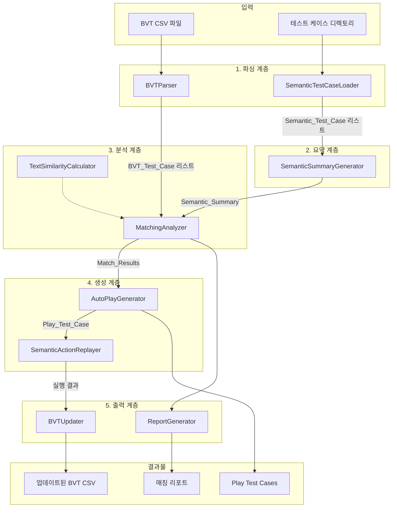

# Design Document: BVT-Semantic Test Integration

## Overview

BVT(Build Verification Test) 테스트 데이터와 의미론적 테스트 케이스를 연결하여 자동화된 QA 파이프라인을 구축하는 시스템이다. 이 시스템은 다음과 같은 핵심 기능을 제공한다:

1. **BVT 파싱**: CSV 형식의 BVT 문서를 구조화된 객체로 변환
2. **의미론적 요약 생성**: 녹화된 테스트 케이스들의 의미론적 정보를 종합한 요약 문서 생성
3. **매칭 분석**: BVT 항목과 테스트 케이스 간의 연관관계 분석
4. **자동 플레이 테스트 생성**: 매칭된 데이터를 바탕으로 재생 가능한 테스트 케이스 생성
5. **BVT 업데이트**: 테스트 결과를 반영한 새로운 BVT 문서 생성

기존 시스템의 SemanticActionRecorder, SemanticActionReplayer, UIAnalyzer 모듈을 활용하여 의미론적 매칭 기반의 테스트 재생을 수행한다.

## Architecture



### 계층 구조

시스템은 Clean Architecture 원칙에 따라 다음과 같은 계층으로 구성된다:

1. **파싱 계층 (Parsing Layer)**: 외부 데이터를 내부 도메인 객체로 변환
2. **요약 계층 (Summary Layer)**: 테스트 케이스의 의미론적 정보를 종합
3. **분석 계층 (Analysis Layer)**: BVT와 테스트 케이스 간 매칭 분석
4. **생성 계층 (Generation Layer)**: 플레이 테스트 생성 및 실행
5. **출력 계층 (Output Layer)**: 결과물 생성 (BVT 업데이트, 리포트)

## Components and Interfaces

### 1. BVTParser

BVT CSV 파일을 파싱하여 BVT_Test_Case 객체 리스트로 변환한다.

```python
class BVTParser:
    """BVT CSV 파일 파서"""
    
    def parse(self, file_path: str) -> List[BVTTestCase]:
        """BVT CSV 파일을 파싱하여 테스트 케이스 리스트 반환
        
        Args:
            file_path: BVT CSV 파일 경로
            
        Returns:
            BVTTestCase 객체 리스트
            
        Raises:
            BVTParseError: 파싱 실패 시
        """
        pass
    
    def write(self, test_cases: List[BVTTestCase], output_path: str) -> None:
        """BVT 테스트 케이스를 CSV 파일로 저장
        
        Args:
            test_cases: 저장할 테스트 케이스 리스트
            output_path: 출력 파일 경로
        """
        pass
```

### 2. SemanticTestCaseLoader

테스트 케이스 JSON 파일들을 로드한다.

```python
class SemanticTestCaseLoader:
    """의미론적 테스트 케이스 로더"""
    
    def load_file(self, file_path: str) -> Optional[SemanticTestCase]:
        """단일 테스트 케이스 파일 로드
        
        Args:
            file_path: JSON 파일 경로
            
        Returns:
            SemanticTestCase 객체 또는 None (파싱 실패 시)
        """
        pass
    
    def load_directory(self, dir_path: str) -> List[SemanticTestCase]:
        """디렉토리 내 모든 테스트 케이스 로드
        
        Args:
            dir_path: 테스트 케이스 디렉토리 경로
            
        Returns:
            SemanticTestCase 객체 리스트
        """
        pass
```

### 3. SemanticSummaryGenerator

테스트 케이스들의 의미론적 정보를 종합한 요약 문서를 생성한다.

```python
class SemanticSummaryGenerator:
    """의미론적 요약 문서 생성기"""
    
    def generate(self, test_cases: List[SemanticTestCase]) -> SemanticSummary:
        """테스트 케이스들로부터 요약 문서 생성
        
        Args:
            test_cases: 테스트 케이스 리스트
            
        Returns:
            SemanticSummary 객체
        """
        pass
    
    def extract_action_summary(self, test_case: SemanticTestCase) -> ActionSummary:
        """단일 테스트 케이스의 액션 요약 추출
        
        Args:
            test_case: 테스트 케이스
            
        Returns:
            ActionSummary 객체
        """
        pass
```

### 4. MatchingAnalyzer

BVT 항목과 Semantic_Summary를 비교하여 매칭 결과를 생성한다.

```python
class MatchingAnalyzer:
    """BVT-테스트케이스 매칭 분석기"""
    
    def __init__(self, similarity_calculator: TextSimilarityCalculator):
        self.similarity_calculator = similarity_calculator
    
    def analyze(
        self, 
        bvt_cases: List[BVTTestCase], 
        summary: SemanticSummary
    ) -> List[MatchResult]:
        """BVT 항목들과 요약 문서를 비교 분석
        
        Args:
            bvt_cases: BVT 테스트 케이스 리스트
            summary: 의미론적 요약 문서
            
        Returns:
            MatchResult 리스트
        """
        pass
    
    def find_matching_actions(
        self, 
        bvt_case: BVTTestCase, 
        test_case_summary: TestCaseSummary
    ) -> Optional[ActionRange]:
        """BVT 항목에 해당하는 액션 범위 찾기
        
        Args:
            bvt_case: BVT 테스트 케이스
            test_case_summary: 테스트 케이스 요약
            
        Returns:
            ActionRange 또는 None
        """
        pass
```

### 5. TextSimilarityCalculator

텍스트 유사도를 계산한다.

```python
class TextSimilarityCalculator:
    """텍스트 유사도 계산기"""
    
    def calculate(self, text1: str, text2: str) -> float:
        """두 텍스트 간 유사도 계산
        
        Args:
            text1: 첫 번째 텍스트
            text2: 두 번째 텍스트
            
        Returns:
            유사도 점수 (0.0 ~ 1.0)
        """
        pass
    
    def calculate_with_context(
        self, 
        bvt_check: str, 
        categories: List[str],
        action_descriptions: List[str]
    ) -> float:
        """컨텍스트를 고려한 유사도 계산
        
        Args:
            bvt_check: BVT Check 설명
            categories: BVT Category 리스트
            action_descriptions: 액션 설명 리스트
            
        Returns:
            유사도 점수 (0.0 ~ 1.0)
        """
        pass
```

### 6. AutoPlayGenerator

매칭 결과를 바탕으로 플레이 테스트를 생성하고 실행한다.

```python
class AutoPlayGenerator:
    """자동 플레이 테스트 생성기"""
    
    def __init__(
        self, 
        replayer: SemanticActionReplayer,
        config: ConfigManager
    ):
        self.replayer = replayer
        self.config = config
    
    def generate(self, match_result: MatchResult) -> PlayTestCase:
        """매칭 결과로부터 플레이 테스트 케이스 생성
        
        Args:
            match_result: 매칭 결과
            
        Returns:
            PlayTestCase 객체
        """
        pass
    
    def execute(self, play_test: PlayTestCase) -> PlayTestResult:
        """플레이 테스트 실행
        
        Args:
            play_test: 실행할 플레이 테스트
            
        Returns:
            PlayTestResult 객체
        """
        pass
```

### 7. BVTUpdater

테스트 결과를 BVT 문서에 반영한다.

```python
class BVTUpdater:
    """BVT 문서 업데이터"""
    
    def __init__(self, parser: BVTParser):
        self.parser = parser
    
    def update(
        self, 
        bvt_cases: List[BVTTestCase], 
        results: List[PlayTestResult]
    ) -> List[BVTTestCase]:
        """테스트 결과를 BVT 케이스에 반영
        
        Args:
            bvt_cases: 원본 BVT 케이스 리스트
            results: 플레이 테스트 결과 리스트
            
        Returns:
            업데이트된 BVT 케이스 리스트
        """
        pass
    
    def save(
        self, 
        bvt_cases: List[BVTTestCase], 
        output_dir: str
    ) -> str:
        """업데이트된 BVT를 파일로 저장
        
        Args:
            bvt_cases: 저장할 BVT 케이스 리스트
            output_dir: 출력 디렉토리
            
        Returns:
            저장된 파일 경로
        """
        pass
```

### 8. ReportGenerator

매칭 분석 리포트를 생성한다.

```python
class ReportGenerator:
    """매칭 리포트 생성기"""
    
    def generate(self, match_results: List[MatchResult]) -> MatchingReport:
        """매칭 결과로부터 리포트 생성
        
        Args:
            match_results: 매칭 결과 리스트
            
        Returns:
            MatchingReport 객체
        """
        pass
    
    def to_json(self, report: MatchingReport) -> str:
        """리포트를 JSON 문자열로 변환"""
        pass
    
    def to_markdown(self, report: MatchingReport) -> str:
        """리포트를 Markdown 문자열로 변환"""
        pass
```

### 9. IntegrationPipeline

전체 파이프라인을 조율한다.

```python
class IntegrationPipeline:
    """BVT-의미론적 통합 파이프라인"""
    
    def __init__(
        self,
        bvt_parser: BVTParser,
        tc_loader: SemanticTestCaseLoader,
        summary_generator: SemanticSummaryGenerator,
        matching_analyzer: MatchingAnalyzer,
        play_generator: AutoPlayGenerator,
        bvt_updater: BVTUpdater,
        report_generator: ReportGenerator
    ):
        # 의존성 주입
        pass
    
    def run(
        self, 
        bvt_path: str, 
        test_cases_dir: str,
        dry_run: bool = False,
        progress_callback: Optional[Callable] = None
    ) -> PipelineResult:
        """파이프라인 실행
        
        Args:
            bvt_path: BVT CSV 파일 경로
            test_cases_dir: 테스트 케이스 디렉토리 경로
            dry_run: True이면 분석만 수행
            progress_callback: 진행 상황 콜백
            
        Returns:
            PipelineResult 객체
        """
        pass
```

## Data Models

### BVTTestCase

```python
@dataclass
class BVTTestCase:
    """BVT 테스트 케이스"""
    no: int                      # 테스트 번호
    category1: str               # Category 1 (예: "메인화면")
    category2: str               # Category 2 (예: "공통 UI")
    category3: str               # Category 3 (예: "최초 접속")
    check: str                   # 테스트 항목 설명
    test_result: str             # 테스트 결과 (Not Tested, PASS, Fail, N/A, Block)
    bts_id: str                  # 버그 트래킹 시스템 ID
    comment: str                 # 코멘트
    
    def to_dict(self) -> Dict[str, Any]:
        """딕셔너리로 변환"""
        pass
    
    @classmethod
    def from_dict(cls, data: Dict[str, Any]) -> 'BVTTestCase':
        """딕셔너리에서 생성"""
        pass
```

### SemanticTestCase

기존 시스템의 테스트 케이스 구조를 확장한다.

```python
@dataclass
class SemanticTestCase:
    """의미론적 테스트 케이스"""
    name: str                              # 테스트 케이스 이름
    created_at: str                        # 생성 시간
    actions: List[SemanticAction]          # 액션 리스트
    json_path: str                         # JSON 파일 경로
    
    def to_dict(self) -> Dict[str, Any]:
        """딕셔너리로 변환"""
        pass
    
    @classmethod
    def from_dict(cls, data: Dict[str, Any]) -> 'SemanticTestCase':
        """딕셔너리에서 생성"""
        pass
```

### ActionSummary

단일 테스트 케이스의 액션 요약이다.

```python
@dataclass
class ActionSummary:
    """액션 요약"""
    test_case_name: str                    # 테스트 케이스 이름
    intents: List[str]                     # 수행하는 의도 리스트
    target_elements: List[str]             # 상호작용하는 UI 요소 리스트
    screen_states: List[str]               # 화면 상태 리스트
    action_descriptions: List[str]         # 액션 설명 리스트
    action_count: int                      # 총 액션 수
```

### SemanticSummary

모든 테스트 케이스의 요약 문서이다.

```python
@dataclass
class SemanticSummary:
    """의미론적 요약 문서"""
    generated_at: str                      # 생성 시간
    test_case_summaries: List[ActionSummary]  # 테스트 케이스별 요약
    total_test_cases: int                  # 총 테스트 케이스 수
    total_actions: int                     # 총 액션 수
    
    def to_dict(self) -> Dict[str, Any]:
        """딕셔너리로 변환"""
        pass
    
    @classmethod
    def from_dict(cls, data: Dict[str, Any]) -> 'SemanticSummary':
        """딕셔너리에서 생성"""
        pass
```

### ActionRange

매칭된 액션의 인덱스 범위이다.

```python
@dataclass
class ActionRange:
    """액션 인덱스 범위"""
    start_index: int                       # 시작 인덱스 (포함)
    end_index: int                         # 종료 인덱스 (포함)
    
    @property
    def length(self) -> int:
        """범위 내 액션 수"""
        return self.end_index - self.start_index + 1
```

### MatchResult

매칭 분석 결과이다.

```python
@dataclass
class MatchResult:
    """매칭 결과"""
    bvt_case: BVTTestCase                  # BVT 테스트 케이스
    matched_test_case: Optional[str]       # 매칭된 테스트 케이스 이름
    action_range: Optional[ActionRange]    # 매칭된 액션 범위
    confidence_score: float                # 신뢰도 점수 (0.0 ~ 1.0)
    is_high_confidence: bool               # 고신뢰도 여부 (>= 0.7)
    match_details: Dict[str, Any]          # 매칭 세부 정보
    
    @property
    def is_matched(self) -> bool:
        """매칭 여부"""
        return self.matched_test_case is not None
```

### PlayTestCase

자동 플레이 테스트 케이스이다.

```python
@dataclass
class PlayTestCase:
    """플레이 테스트 케이스"""
    name: str                              # 테스트 이름
    bvt_reference: BVTReference            # BVT 참조 정보
    source_test_case: str                  # 원본 테스트 케이스 이름
    actions: List[SemanticAction]          # 실행할 액션 리스트
    created_at: str                        # 생성 시간
    
    def to_dict(self) -> Dict[str, Any]:
        """딕셔너리로 변환"""
        pass
    
    @classmethod
    def from_dict(cls, data: Dict[str, Any]) -> 'PlayTestCase':
        """딕셔너리에서 생성"""
        pass
```

### BVTReference

BVT 참조 정보이다.

```python
@dataclass
class BVTReference:
    """BVT 참조 정보"""
    no: int                                # BVT 번호
    category1: str                         # Category 1
    category2: str                         # Category 2
    category3: str                         # Category 3
    check: str                             # Check 설명
```

### PlayTestResult

플레이 테스트 실행 결과이다.

```python
@dataclass
class PlayTestResult:
    """플레이 테스트 결과"""
    play_test_name: str                    # 테스트 이름
    bvt_no: int                            # BVT 번호
    status: TestStatus                     # 테스트 상태 (PASS, FAIL, BLOCKED)
    executed_actions: int                  # 실행된 액션 수
    failed_actions: int                    # 실패한 액션 수
    screenshots: List[str]                 # 스크린샷 경로 리스트
    error_message: Optional[str]           # 오류 메시지
    execution_time: float                  # 실행 시간 (초)
```

### TestStatus

테스트 상태 열거형이다.

```python
class TestStatus(Enum):
    """테스트 상태"""
    PASS = "PASS"
    FAIL = "Fail"
    BLOCKED = "Block"
    NOT_TESTED = "Not Tested"
```

### MatchingReport

매칭 리포트이다.

```python
@dataclass
class MatchingReport:
    """매칭 리포트"""
    generated_at: str                      # 생성 시간
    total_bvt_items: int                   # 총 BVT 항목 수
    matched_items: int                     # 매칭된 항목 수
    unmatched_items: int                   # 미매칭 항목 수
    high_confidence_matches: List[MatchResult]  # 고신뢰도 매칭 리스트
    low_confidence_matches: List[MatchResult]   # 저신뢰도 매칭 리스트
    unmatched_bvt_cases: List[BVTTestCase]      # 미매칭 BVT 케이스 리스트
    coverage_percentage: float             # 커버리지 백분율
```

### PipelineResult

파이프라인 실행 결과이다.

```python
@dataclass
class PipelineResult:
    """파이프라인 결과"""
    success: bool                          # 성공 여부
    bvt_output_path: Optional[str]         # 업데이트된 BVT 파일 경로
    report_json_path: Optional[str]        # JSON 리포트 경로
    report_md_path: Optional[str]          # Markdown 리포트 경로
    play_tests_dir: Optional[str]          # 플레이 테스트 디렉토리
    matching_report: Optional[MatchingReport]  # 매칭 리포트
    error_message: Optional[str]           # 오류 메시지
    execution_time: float                  # 총 실행 시간
```


## Correctness Properties

*A property is a characteristic or behavior that should hold true across all valid executions of a system-essentially, a formal statement about what the system should do. Properties serve as the bridge between human-readable specifications and machine-verifiable correctness guarantees.*

### Property 1: BVT 파싱 정확성

*For any* 유효한 BVT CSV 파일, BVT_Parser로 파싱한 결과는 파일 내 모든 테스트 케이스 행을 포함하고, 각 BVT_Test_Case 객체는 No., Category 1~3, Check, Test Result, BTS ID, Comment 필드를 정확히 포함해야 한다.

**Validates: Requirements 1.1, 1.2**

### Property 2: BVT_Test_Case round-trip

*For any* 유효한 BVT_Test_Case 객체, to_dict()로 직렬화한 후 from_dict()로 역직렬화하면 원본과 동등한 객체가 생성되어야 한다.

**Validates: Requirements 1.5**

### Property 3: Semantic_Summary 생성 정확성

*For any* Semantic_Test_Case 리스트, SemanticSummaryGenerator로 생성한 Semantic_Summary는 각 테스트 케이스의 intent, target_element, context 정보를 포함하는 ActionSummary를 가져야 하고, total_test_cases는 입력 리스트의 길이와 같아야 한다.

**Validates: Requirements 2.1, 2.4, 2.5, 2.6**

### Property 4: Semantic_Test_Case round-trip

*For any* 유효한 Semantic_Test_Case 객체, to_dict()로 직렬화한 후 from_dict()로 역직렬화하면 원본과 동등한 객체가 생성되어야 한다.

**Validates: Requirements 2.7**

### Property 5: Match_Result 구조 정확성

*For any* BVT_Test_Case와 Semantic_Summary 쌍, MatchingAnalyzer.analyze()의 결과인 Match_Result는 confidence_score(0.0~1.0), bvt_case 참조, 그리고 매칭된 경우 matched_test_case와 action_range를 포함해야 한다.

**Validates: Requirements 3.1, 3.6, 3.7, 3.8**

### Property 6: 텍스트 유사도 계산 정확성

*For any* 두 텍스트 문자열, TextSimilarityCalculator.calculate()의 결과는 0.0에서 1.0 사이이고, 동일한 문자열에 대해서는 1.0을 반환하며, 완전히 다른 문자열에 대해서는 0.0에 가까운 값을 반환해야 한다.

**Validates: Requirements 3.2, 3.3**

### Property 7: 고신뢰도 임계값 일관성

*For any* Match_Result, confidence_score가 0.7 이상이면 is_high_confidence가 True이고, 0.7 미만이면 is_high_confidence가 False여야 한다.

**Validates: Requirements 3.4**

### Property 8: 매칭 결과 정렬

*For any* BVT_Test_Case에 대한 여러 매칭 결과, 반환된 리스트는 confidence_score 내림차순으로 정렬되어 있어야 한다.

**Validates: Requirements 3.5**

### Property 9: 매칭 분석 결정론성

*For any* 동일한 BVT_Test_Case 리스트와 Semantic_Summary, MatchingAnalyzer.analyze()를 여러 번 호출해도 항상 동일한 Match_Result 리스트를 반환해야 한다.

**Validates: Requirements 3.9**

### Property 10: Play_Test_Case 생성 정확성

*For any* 고신뢰도 Match_Result, AutoPlayGenerator.generate()의 결과인 Play_Test_Case는 Match_Result의 action_range에 해당하는 액션들만 포함하고, BVT 참조 정보(no, categories, check)를 포함해야 한다.

**Validates: Requirements 4.1, 4.2, 4.3, 4.7**

### Property 11: Play_Test_Case round-trip

*For any* 유효한 Play_Test_Case 객체, to_dict()로 직렬화한 후 from_dict()로 역직렬화하면 원본과 동등한 객체가 생성되어야 한다.

**Validates: Requirements 4.8**

### Property 12: BVT 업데이트 정확성

*For any* BVT_Test_Case와 PlayTestResult 쌍, BVTUpdater.update()의 결과는 PlayTestResult.status가 PASS이면 test_result가 "PASS"이고, FAIL이면 test_result가 "Fail"이며 comment에 오류 정보가 추가되어야 한다.

**Validates: Requirements 5.1, 5.2, 5.3**

### Property 13: BTS ID 보존

*For any* BVT_Test_Case와 PlayTestResult 쌍, BVTUpdater.update() 후에도 원본 BVT_Test_Case의 bts_id 값은 변경되지 않아야 한다.

**Validates: Requirements 5.4**

### Property 14: BVT 파일 round-trip

*For any* BVT_Test_Case 리스트, BVTParser.write()로 CSV 파일을 생성한 후 BVTParser.parse()로 다시 파싱하면 원본과 동등한 리스트가 생성되어야 한다.

**Validates: Requirements 5.5, 5.7**

### Property 15: 리포트 구조 정확성

*For any* Match_Result 리스트, ReportGenerator.generate()의 결과인 MatchingReport는 total_bvt_items, matched_items, unmatched_items 카운트를 포함하고, high_confidence_matches와 unmatched_bvt_cases 리스트를 포함해야 한다.

**Validates: Requirements 6.1, 6.2, 6.3**

### Property 16: 커버리지 계산 정확성

*For any* MatchingReport, coverage_percentage는 (matched_items / total_bvt_items) * 100과 같아야 한다.

**Validates: Requirements 6.4**

## Error Handling

### 파싱 오류

1. **BVT CSV 파싱 오류**
   - 파일이 존재하지 않는 경우: `FileNotFoundError` 발생
   - CSV 형식이 잘못된 경우: `BVTParseError` 발생 (설명적 메시지 포함)
   - 필수 컬럼이 누락된 경우: `BVTParseError` 발생 (누락된 컬럼 명시)

2. **테스트 케이스 JSON 파싱 오류**
   - 파일이 존재하지 않는 경우: 로그 기록 후 건너뜀
   - JSON 형식이 잘못된 경우: 로그 기록 후 건너뜀
   - 필수 필드가 누락된 경우: 로그 기록 후 건너뜀

### 매칭 오류

1. **빈 입력 처리**
   - BVT 케이스가 없는 경우: 빈 Match_Result 리스트 반환
   - 테스트 케이스가 없는 경우: 모든 BVT 케이스를 미매칭으로 표시

2. **텍스트 유사도 계산 오류**
   - 빈 문자열 입력: 0.0 반환
   - None 입력: 0.0 반환

### 실행 오류

1. **플레이 테스트 실행 오류**
   - 개별 액션 실패: 로그 기록 후 다음 액션 계속
   - 전체 실패: BLOCKED 상태로 결과 기록

2. **파이프라인 오류**
   - 단계별 실패: 오류 로그 기록, 부분 결과 반환
   - 치명적 오류: PipelineResult.success = False, error_message 설정

### 파일 I/O 오류

1. **출력 파일 생성 오류**
   - 디렉토리가 없는 경우: 자동 생성 시도
   - 권한 오류: 예외 발생 및 로그 기록

## Testing Strategy

### 단위 테스트

단위 테스트는 개별 컴포넌트의 특정 동작을 검증한다:

1. **BVTParser 단위 테스트**
   - 헤더/요약 행 건너뛰기 테스트
   - 잘못된 형식 오류 처리 테스트

2. **SemanticTestCaseLoader 단위 테스트**
   - 잘못된 JSON 파일 건너뛰기 테스트
   - 빈 디렉토리 처리 테스트

3. **ReportGenerator 단위 테스트**
   - JSON 출력 형식 검증
   - Markdown 출력 형식 검증

4. **IntegrationPipeline 단위 테스트**
   - dry-run 모드 동작 테스트
   - 진행 콜백 호출 테스트
   - 단계별 실패 처리 테스트

### Property-Based 테스트

Property-based 테스트는 hypothesis 라이브러리를 사용하여 구현한다. 각 테스트는 최소 100회 반복 실행한다.

```python
# 테스트 설정 예시
from hypothesis import given, settings, strategies as st

@settings(max_examples=100)
@given(...)
def test_property_name(self, ...):
    # Feature: bvt-semantic-integration, Property N: property_text
    pass
```

**구현할 Property 테스트:**

1. Property 1: BVT 파싱 정확성
2. Property 2: BVT_Test_Case round-trip
3. Property 3: Semantic_Summary 생성 정확성
4. Property 4: Semantic_Test_Case round-trip
5. Property 5: Match_Result 구조 정확성
6. Property 6: 텍스트 유사도 계산 정확성
7. Property 7: 고신뢰도 임계값 일관성
8. Property 8: 매칭 결과 정렬
9. Property 9: 매칭 분석 결정론성
10. Property 10: Play_Test_Case 생성 정확성
11. Property 11: Play_Test_Case round-trip
12. Property 12: BVT 업데이트 정확성
13. Property 13: BTS ID 보존
14. Property 14: BVT 파일 round-trip
15. Property 15: 리포트 구조 정확성
16. Property 16: 커버리지 계산 정확성

### 테스트 데이터 생성 전략

hypothesis의 strategies를 사용하여 테스트 데이터를 생성한다:

```python
# BVT_Test_Case 생성 전략
bvt_test_case_strategy = st.builds(
    BVTTestCase,
    no=st.integers(min_value=1, max_value=1000),
    category1=st.text(min_size=1, max_size=50),
    category2=st.text(min_size=0, max_size=50),
    category3=st.text(min_size=0, max_size=50),
    check=st.text(min_size=1, max_size=200),
    test_result=st.sampled_from(["Not Tested", "PASS", "Fail", "N/A", "Block"]),
    bts_id=st.text(min_size=0, max_size=20),
    comment=st.text(min_size=0, max_size=500)
)

# SemanticAction 생성 전략
semantic_action_strategy = st.builds(
    SemanticAction,
    timestamp=st.datetimes().map(lambda dt: dt.isoformat()),
    action_type=st.sampled_from(["click", "key_press", "scroll", "wait"]),
    x=st.integers(min_value=0, max_value=1920),
    y=st.integers(min_value=0, max_value=1080),
    description=st.text(min_size=1, max_size=100),
    # ... 기타 필드
)
```
