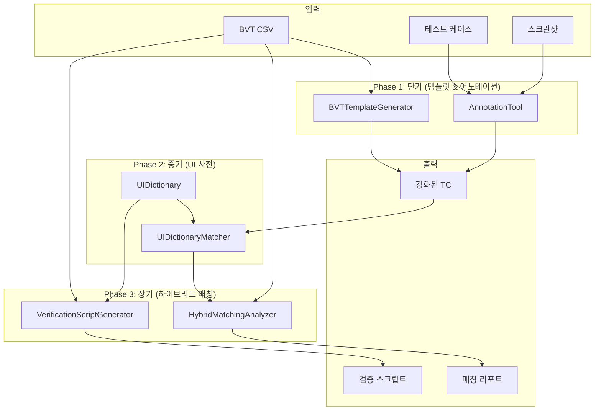

# Design Document: BVT-TC 연결 강화

## Overview

BVT 테스트 항목과 테스트 케이스(TC) 간의 매칭 정확도를 향상시키는 시스템이다. 아이콘 기반 UI, 맥락 정보 부재 등의 문제를 해결하기 위해 다음 기능을 제공한다:

1. **BVT 기반 TC 템플릿 생성**: BVT 항목에서 TC 템플릿을 자동 생성
2. **수동 어노테이션 도구**: 스크린샷에 의미론적 정보를 수동 추가
3. **게임별 UI 사전**: 아이콘-의미 매핑 사전 관리
4. **하이브리드 매칭 전략**: 다양한 신호를 종합한 매칭
5. **검증 스크립트 자동 생성**: BVT check에서 검증 로직 추출

## Architecture



## Components and Interfaces

### Phase 1: 단기 구현

#### 1.1 BVTTemplateGenerator

BVT 항목에서 TC 템플릿을 자동 생성한다.

```python
class BVTTemplateGenerator:
    """BVT 기반 TC 템플릿 생성기
    
    Requirements: 1.1, 1.2, 1.3, 1.4, 1.5, 1.6
    """
    
    def __init__(self, bvt_parser: BVTParser):
        self.bvt_parser = bvt_parser
        self.keyword_extractor = KeywordExtractor()
    
    def generate(self, bvt_no: int, output_dir: str) -> str:
        """단일 BVT 항목에서 TC 템플릿 생성
        
        Args:
            bvt_no: BVT 번호
            output_dir: 출력 디렉토리
            
        Returns:
            생성된 템플릿 파일 경로
        """
        pass
    
    def generate_batch(self, bvt_nos: List[int], output_dir: str) -> List[str]:
        """여러 BVT 항목에서 TC 템플릿 배치 생성
        
        Args:
            bvt_nos: BVT 번호 리스트
            output_dir: 출력 디렉토리
            
        Returns:
            생성된 템플릿 파일 경로 리스트
        """
        pass
    
    def extract_verification_hints(self, bvt_case: BVTTestCase) -> VerificationHints:
        """BVT check 설명에서 검증 힌트 추출
        
        Args:
            bvt_case: BVT 테스트 케이스
            
        Returns:
            추출된 검증 힌트
        """
        pass
```

#### 1.2 AnnotationTool

스크린샷에 수동 어노테이션을 추가한다.

```python
class AnnotationTool:
    """수동 어노테이션 도구
    
    Requirements: 2.1, 2.2, 2.3, 2.4, 2.5, 2.6, 2.7
    """
    
    def __init__(self, tc_loader: SemanticTestCaseLoader):
        self.tc_loader = tc_loader
    
    def load_test_case(self, tc_path: str) -> AnnotatableTestCase:
        """테스트 케이스 로드
        
        Args:
            tc_path: TC JSON 파일 경로
            
        Returns:
            어노테이션 가능한 TC 객체
        """
        pass
    
    def add_annotation(
        self, 
        action_index: int,
        region: Region,
        label: str,
        element_type: str,
        bvt_link: Optional[int] = None
    ) -> Annotation:
        """어노테이션 추가
        
        Args:
            action_index: 액션 인덱스
            region: 영역 (x, y, width, height)
            label: 의미론적 라벨
            element_type: 요소 타입 (icon, text, button 등)
            bvt_link: 연결할 BVT 번호 (선택)
            
        Returns:
            생성된 어노테이션
        """
        pass
    
    def save(self, output_path: Optional[str] = None) -> str:
        """어노테이션된 TC 저장
        
        Args:
            output_path: 출력 경로 (None이면 원본 업데이트)
            
        Returns:
            저장된 파일 경로
        """
        pass
    
    def annotate_cli(self, tc_path: str) -> None:
        """CLI 모드로 어노테이션 수행"""
        pass
```

### Phase 2: 중기 구현

#### 2.1 UIDictionary

게임별 UI 요소 사전을 관리한다.

```python
class UIDictionary:
    """게임별 UI 사전
    
    Requirements: 3.1, 3.2, 3.3, 3.5, 3.6, 3.7
    """
    
    def __init__(self, dictionary_dir: str = "ui_dictionaries"):
        self.dictionary_dir = dictionary_dir
        self.current_game: Optional[str] = None
        self.entries: Dict[str, UIEntry] = {}
    
    def load(self, game_name: str) -> None:
        """게임별 사전 로드
        
        Args:
            game_name: 게임 이름
        """
        pass
    
    def add_entry(self, entry: UIEntry) -> None:
        """사전 항목 추가
        
        Args:
            entry: UI 항목
        """
        pass
    
    def find_by_keywords(self, keywords: List[str]) -> List[UIEntry]:
        """키워드로 항목 검색
        
        Args:
            keywords: 검색 키워드
            
        Returns:
            매칭된 항목 리스트
        """
        pass
    
    def find_by_location(self, location: str) -> List[UIEntry]:
        """위치로 항목 검색
        
        Args:
            location: 화면 위치 설명
            
        Returns:
            매칭된 항목 리스트
        """
        pass
    
    def save(self) -> None:
        """현재 사전 저장"""
        pass
```

#### 2.2 UIDictionaryMatcher

Vision LLM 결과와 UI 사전을 매칭한다.

```python
class UIDictionaryMatcher:
    """UI 사전 매처
    
    Requirements: 3.4, 3.7
    """
    
    def __init__(self, dictionary: UIDictionary):
        self.dictionary = dictionary
    
    def enhance_semantic_info(
        self, 
        semantic_info: Dict[str, Any],
        screenshot: Optional[Image.Image] = None
    ) -> Dict[str, Any]:
        """의미론적 정보 보강
        
        Vision LLM 분석 결과를 UI 사전과 매칭하여 보강한다.
        
        Args:
            semantic_info: 원본 의미론적 정보
            screenshot: 스크린샷 (시각적 매칭용)
            
        Returns:
            보강된 의미론적 정보
        """
        pass
    
    def match_template(
        self, 
        screenshot: Image.Image,
        entry: UIEntry
    ) -> float:
        """템플릿 이미지 매칭
        
        Args:
            screenshot: 스크린샷
            entry: UI 사전 항목
            
        Returns:
            매칭 신뢰도 (0.0 ~ 1.0)
        """
        pass
```

### Phase 3: 장기 구현

#### 3.1 HybridMatchingAnalyzer

다양한 신호를 종합하여 매칭한다.

```python
class HybridMatchingAnalyzer:
    """하이브리드 매칭 분석기
    
    Requirements: 4.1, 4.2, 4.3, 4.4, 4.5, 4.6, 4.7
    """
    
    def __init__(
        self,
        text_analyzer: MatchingAnalyzer,
        dictionary_matcher: UIDictionaryMatcher,
        config: Optional[Dict[str, float]] = None
    ):
        self.text_analyzer = text_analyzer
        self.dictionary_matcher = dictionary_matcher
        self.weights = config or {
            "text_similarity": 0.4,
            "location_matching": 0.3,
            "visual_pattern": 0.2,
            "annotation_bonus": 0.1
        }
    
    def analyze(
        self, 
        bvt_cases: List[BVTTestCase],
        summary: SemanticSummary,
        screenshots: Optional[Dict[str, Image.Image]] = None
    ) -> List[HybridMatchResult]:
        """하이브리드 매칭 분석
        
        Args:
            bvt_cases: BVT 케이스 리스트
            summary: 의미론적 요약
            screenshots: 스크린샷 딕셔너리 (선택)
            
        Returns:
            하이브리드 매칭 결과 리스트
        """
        pass
    
    def _calculate_location_score(
        self, 
        bvt_case: BVTTestCase,
        action_summary: ActionSummary
    ) -> float:
        """화면 위치 매칭 점수 계산"""
        pass
    
    def _calculate_visual_score(
        self, 
        bvt_case: BVTTestCase,
        screenshots: Dict[str, Image.Image]
    ) -> float:
        """시각적 패턴 매칭 점수 계산"""
        pass
    
    def _calculate_annotation_bonus(
        self, 
        bvt_case: BVTTestCase,
        action_summary: ActionSummary
    ) -> float:
        """어노테이션 보너스 점수 계산"""
        pass
```

#### 3.2 VerificationScriptGenerator

BVT check에서 검증 스크립트를 생성한다.

```python
class VerificationScriptGenerator:
    """검증 스크립트 생성기
    
    Requirements: 5.1, 5.2, 5.3, 5.4, 5.5, 5.6, 5.7
    """
    
    def __init__(self, dictionary: UIDictionary):
        self.dictionary = dictionary
        self.pattern_handlers = {
            "노출 확인": self._generate_visibility_check,
            "터치 시": self._generate_touch_transition_check,
            "입장": self._generate_navigation_check,
            "동작 확인": self._generate_function_check
        }
    
    def generate(self, bvt_case: BVTTestCase) -> VerificationScript:
        """검증 스크립트 생성
        
        Args:
            bvt_case: BVT 테스트 케이스
            
        Returns:
            생성된 검증 스크립트
        """
        pass
    
    def _generate_visibility_check(
        self, 
        elements: List[str]
    ) -> str:
        """요소 존재 확인 코드 생성"""
        pass
    
    def _generate_touch_transition_check(
        self, 
        source: str, 
        target: str
    ) -> str:
        """터치 후 화면 전환 확인 코드 생성"""
        pass
    
    def _generate_navigation_check(
        self, 
        menu_name: str
    ) -> str:
        """메뉴 이동 확인 코드 생성"""
        pass
```

## Data Models

### BVTTemplate

BVT 기반 TC 템플릿이다.

```python
@dataclass
class BVTTemplate:
    """BVT 기반 TC 템플릿
    
    Requirements: 1.1, 1.2
    """
    name: str
    bvt_reference: BVTReference
    verification_hints: VerificationHints
    actions: List[SemanticAction] = field(default_factory=list)
    created_at: str = ""
    
    def to_dict(self) -> Dict[str, Any]:
        pass
    
    @classmethod
    def from_dict(cls, data: Dict[str, Any]) -> 'BVTTemplate':
        pass
```

### VerificationHints

BVT check에서 추출한 검증 힌트이다.

```python
@dataclass
class VerificationHints:
    """검증 힌트
    
    Requirements: 1.2, 1.3
    """
    target_elements: List[str]      # 확인해야 할 UI 요소
    expected_values: List[str]      # 기대 값 (예: "숫자 표시")
    screen_location: str            # 화면 위치 (예: "화면 상단")
    verification_type: str          # 검증 타입 (visibility, transition, function)
    keywords: List[str]             # 추출된 키워드
    
    def to_dict(self) -> Dict[str, Any]:
        pass
    
    @classmethod
    def from_dict(cls, data: Dict[str, Any]) -> 'VerificationHints':
        pass
```

### Annotation

수동 어노테이션 정보이다.

```python
@dataclass
class Annotation:
    """어노테이션
    
    Requirements: 2.3, 2.4, 2.5
    """
    label: str                      # 의미론적 라벨
    region: Region                  # 영역 (x, y, width, height)
    element_type: str               # 요소 타입 (icon, text, button 등)
    bvt_link: Optional[int] = None  # 연결된 BVT 번호
    confidence: float = 1.0         # 신뢰도 (수동은 1.0)
    
    def to_dict(self) -> Dict[str, Any]:
        pass
    
    @classmethod
    def from_dict(cls, data: Dict[str, Any]) -> 'Annotation':
        pass
```

### Region

영역 정보이다.

```python
@dataclass
class Region:
    """영역
    
    Requirements: 2.3
    """
    x: int
    y: int
    width: int
    height: int
    
    def contains(self, px: int, py: int) -> bool:
        """점이 영역 내에 있는지 확인"""
        pass
    
    def to_dict(self) -> Dict[str, Any]:
        pass
    
    @classmethod
    def from_dict(cls, data: Dict[str, Any]) -> 'Region':
        pass
```

### UIEntry

UI 사전 항목이다.

```python
@dataclass
class UIEntry:
    """UI 사전 항목
    
    Requirements: 3.2, 3.3, 3.7
    """
    id: str                         # 고유 ID
    visual_pattern: str             # 시각적 설명
    semantic_meaning: str           # 의미
    typical_location: str           # 일반적 위치
    bvt_keywords: List[str]         # 관련 BVT 키워드
    template_image_path: Optional[str] = None  # 템플릿 이미지 경로
    confidence: float = 0.8         # 기본 신뢰도
    
    def to_dict(self) -> Dict[str, Any]:
        pass
    
    @classmethod
    def from_dict(cls, data: Dict[str, Any]) -> 'UIEntry':
        pass
```

### HybridMatchResult

하이브리드 매칭 결과이다.

```python
@dataclass
class HybridMatchResult:
    """하이브리드 매칭 결과
    
    Requirements: 4.6
    """
    bvt_case: BVTTestCase
    matched_test_case: Optional[str]
    action_range: Optional[ActionRange]
    
    # 종합 점수
    total_score: float
    is_high_confidence: bool
    
    # 개별 점수
    text_similarity_score: float
    location_matching_score: float
    visual_pattern_score: float
    annotation_bonus_score: float
    
    # 상세 정보
    match_details: Dict[str, Any] = field(default_factory=dict)
    
    def to_dict(self) -> Dict[str, Any]:
        pass
    
    @classmethod
    def from_dict(cls, data: Dict[str, Any]) -> 'HybridMatchResult':
        pass
```

### VerificationScript

검증 스크립트이다.

```python
@dataclass
class VerificationScript:
    """검증 스크립트
    
    Requirements: 5.5, 5.7
    """
    bvt_no: int
    function_name: str
    code: str                       # Python 함수 코드
    required_templates: List[str]   # 필요한 템플릿 이미지
    manual_additions: str = ""      # 수동 추가 코드
    
    def execute(self, screenshot: Image.Image) -> VerificationResult:
        """검증 실행"""
        pass
    
    def to_dict(self) -> Dict[str, Any]:
        pass
    
    @classmethod
    def from_dict(cls, data: Dict[str, Any]) -> 'VerificationScript':
        pass
```

## File Formats

### UI Dictionary JSON

```json
{
  "game_name": "tskgb",
  "version": "1.0",
  "entries": {
    "key_icon": {
      "id": "key_icon",
      "visual_pattern": "열쇠 모양 아이콘, 금색",
      "semantic_meaning": "열쇠 재화",
      "typical_location": "화면 상단 우측",
      "bvt_keywords": ["열쇠", "key", "재화"],
      "template_image_path": "templates/key_icon.png",
      "confidence": 0.9
    },
    "gold_icon": {
      "id": "gold_icon",
      "visual_pattern": "금화 모양 아이콘, 노란색",
      "semantic_meaning": "골드 재화",
      "typical_location": "화면 상단 우측",
      "bvt_keywords": ["골드", "gold", "재화", "금화"],
      "template_image_path": "templates/gold_icon.png",
      "confidence": 0.9
    }
  }
}
```

### Annotated Test Case JSON

```json
{
  "name": "bvt_004_currency_display",
  "bvt_reference": {
    "no": 4,
    "category1": "메인화면",
    "category2": "공통 UI",
    "category3": "보유 재화 목록",
    "check": "열쇠/골드/루비 수량 노출 확인"
  },
  "verification_hints": {
    "target_elements": ["열쇠 아이콘", "골드 아이콘", "루비 아이콘"],
    "expected_values": ["숫자 표시"],
    "screen_location": "화면 상단",
    "verification_type": "visibility",
    "keywords": ["열쇠", "골드", "루비", "수량", "노출"]
  },
  "actions": [
    {
      "timestamp": "2026-01-24T10:00:00",
      "action_type": "click",
      "x": 100,
      "y": 50,
      "semantic_info": {
        "intent": "verify_currency",
        "target_element": {
          "type": "icon",
          "text": "열쇠"
        },
        "annotations": [
          {
            "label": "열쇠 아이콘",
            "region": {"x": 80, "y": 30, "width": 40, "height": 40},
            "element_type": "icon",
            "bvt_link": 4,
            "confidence": 1.0
          },
          {
            "label": "열쇠 수량: 12345",
            "region": {"x": 120, "y": 35, "width": 60, "height": 30},
            "element_type": "text",
            "bvt_link": 4,
            "confidence": 1.0
          }
        ]
      }
    }
  ]
}
```

## Correctness Properties

### Property 1: 템플릿 생성 정확성

*For any* 유효한 BVT 번호, BVTTemplateGenerator.generate()의 결과는 해당 BVT 항목의 모든 정보(no, categories, check)를 포함하고, verification_hints가 check 설명에서 추출된 키워드를 포함해야 한다.

**Validates: Requirements 1.1, 1.2, 1.3**

### Property 2: 어노테이션 round-trip

*For any* 유효한 Annotation 객체, to_dict()로 직렬화한 후 from_dict()로 역직렬화하면 원본과 동등한 객체가 생성되어야 한다.

**Validates: Requirements 2.3, 2.4**

### Property 3: UI 사전 키워드 매칭 정확성

*For any* UI 사전 항목과 키워드 리스트, find_by_keywords()는 bvt_keywords에 해당 키워드가 포함된 모든 항목을 반환해야 한다.

**Validates: Requirements 3.4**

### Property 4: 하이브리드 점수 범위

*For any* HybridMatchResult, total_score와 모든 개별 점수는 0.0에서 1.0 사이여야 한다.

**Validates: Requirements 4.1, 4.6**

### Property 5: 하이브리드 점수 가중 합계

*For any* HybridMatchResult, total_score는 개별 점수들의 가중 합계와 같아야 한다 (설정된 가중치 기준).

**Validates: Requirements 4.2**

### Property 6: 검증 스크립트 실행 가능성

*For any* 생성된 VerificationScript, code 필드는 유효한 Python 함수 정의여야 하고, exec()로 실행 가능해야 한다.

**Validates: Requirements 5.5**

## Testing Strategy

### 단위 테스트

1. **BVTTemplateGenerator 테스트**
   - 단일 BVT 템플릿 생성
   - 배치 템플릿 생성
   - 키워드 추출 정확성

2. **AnnotationTool 테스트**
   - 어노테이션 추가/삭제
   - 저장/로드 round-trip
   - BVT 링크 연결

3. **UIDictionary 테스트**
   - 사전 로드/저장
   - 키워드 검색
   - 위치 검색

4. **HybridMatchingAnalyzer 테스트**
   - 개별 점수 계산
   - 가중 합계 계산
   - 기존 MatchingAnalyzer와 호환성

### Property-Based 테스트

hypothesis 라이브러리를 사용하여 각 Property를 최소 100회 반복 테스트한다.

## Implementation Phases

### Phase 1: 단기 (1-2주)
- Task 1-3: BVTTemplateGenerator 구현
- Task 4-6: AnnotationTool 구현 (CLI 모드)

### Phase 2: 중기 (2-3주)
- Task 7-9: UIDictionary 구현
- Task 10-11: UIDictionaryMatcher 구현

### Phase 3: 장기 (3-4주)
- Task 12-14: HybridMatchingAnalyzer 구현
- Task 15-17: VerificationScriptGenerator 구현
- Task 18: 통합 워크플로우 구현

