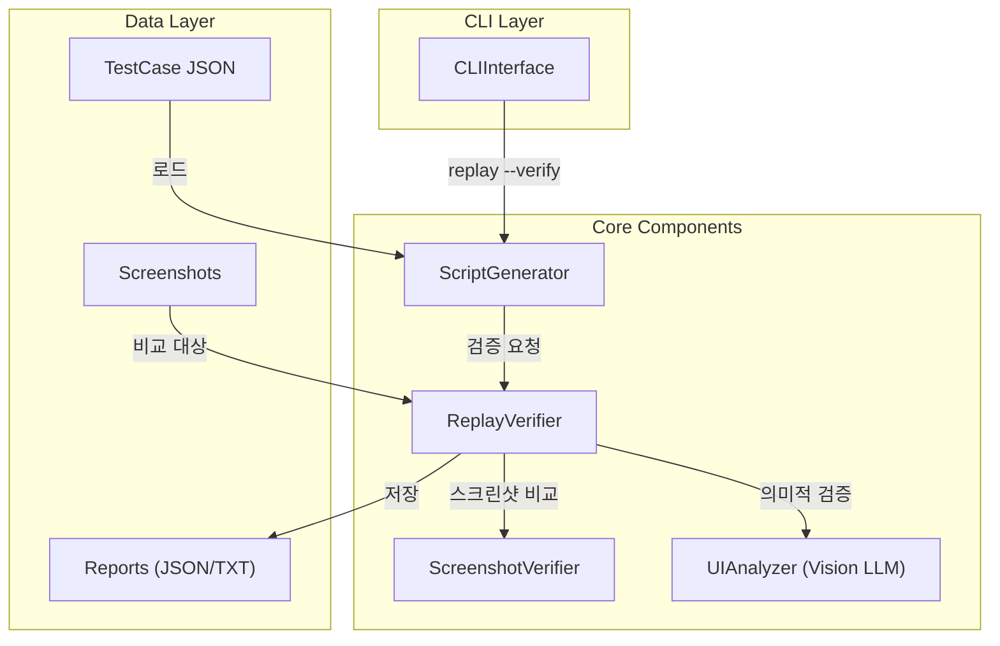
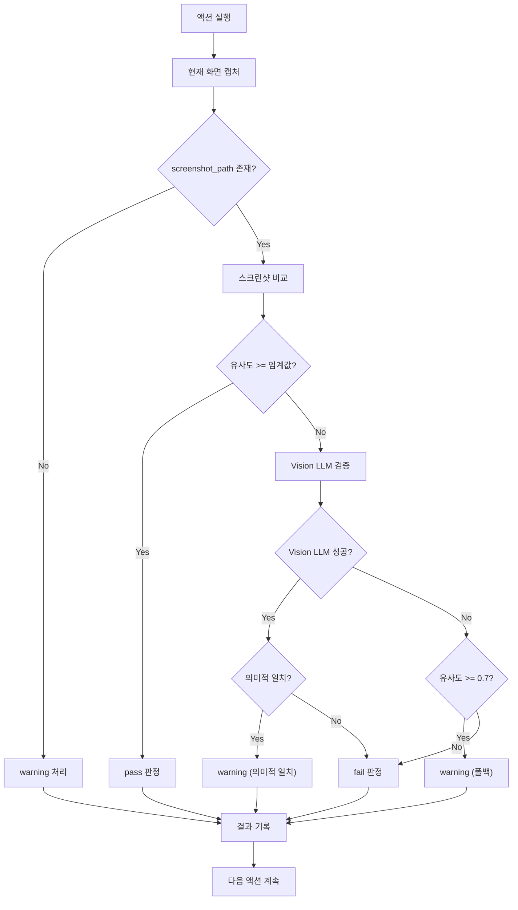

# 설계 문서: 좌표 기반 Replay 검증 기능

## 개요

본 설계는 좌표 기반 테스트 replay에서 테스트 성공/실패 여부를 검증하는 기능을 추가한다. 기존 `ReplayVerifier` 컴포넌트를 활용하여 좌표 기반 replay에서도 의미론적 replay와 동일한 검증 방식(스크린샷 비교 + Vision LLM 재검증)을 적용한다.

### 설계 결정 사항

1. **기존 ReplayVerifier 재사용**: 새로운 검증기를 만들지 않고 기존 `ReplayVerifier`를 확장하여 좌표 기반 replay에서도 사용할 수 있도록 한다. 이는 코드 중복을 방지하고 일관된 검증 로직을 유지하기 위함이다.

2. **옵션 기반 검증 활성화**: `--verify` 옵션을 통해 검증을 선택적으로 활성화한다. 이는 검증 없이 빠른 replay가 필요한 경우와 검증이 필요한 경우를 모두 지원하기 위함이다.

3. **실패 시 계속 실행**: 검증 실패 시에도 나머지 액션을 계속 실행한다. 이는 전체 테스트 흐름을 파악하고 여러 실패 지점을 한 번에 확인할 수 있게 하기 위함이다.

## 아키텍처



## 컴포넌트 및 인터페이스

### 1. ScriptGenerator 확장

기존 `ScriptGenerator`에 검증 기능을 추가한다.

```python
class ScriptGenerator:
    def __init__(self, config: ConfigManager):
        self.config = config
        self.verifier: Optional[ReplayVerifier] = None
        self._verify_mode = False
    
    def replay_with_verification(
        self, 
        test_case: Dict[str, Any],
        verify: bool = False,
        report_dir: str = "reports"
    ) -> Tuple[bool, Optional[ReplayReport]]:
        """검증 모드로 테스트 케이스 재실행
        
        Args:
            test_case: 테스트 케이스 데이터
            verify: 검증 활성화 여부
            report_dir: 보고서 저장 디렉토리
            
        Returns:
            (테스트 성공 여부, 보고서 객체)
        """
        pass
    
    def _execute_action_with_verification(
        self,
        action: Dict[str, Any],
        action_index: int
    ) -> VerificationResult:
        """액션 실행 후 검증 수행
        
        Args:
            action: 액션 데이터
            action_index: 액션 인덱스
            
        Returns:
            검증 결과
        """
        pass
```

### 2. ReplayVerifier 확장

기존 `ReplayVerifier`는 이미 필요한 기능을 대부분 갖추고 있다. 좌표 기반 replay를 위한 추가 메서드만 필요하다.

```python
class ReplayVerifier:
    # 기존 메서드 유지
    
    def verify_coordinate_action(
        self,
        action_index: int,
        action: Dict[str, Any],
        current_screenshot: Image.Image
    ) -> VerificationResult:
        """좌표 기반 액션 검증
        
        semantic_info가 없는 액션에 대해 screenshot_path만으로 검증한다.
        
        Args:
            action_index: 액션 인덱스
            action: 액션 데이터 (screenshot_path 포함)
            current_screenshot: 현재 화면 캡처
            
        Returns:
            검증 결과
        """
        pass
    
    def determine_test_result(self) -> bool:
        """전체 테스트 결과 판정
        
        하나라도 실패한 액션이 있으면 False 반환
        
        Returns:
            테스트 성공 여부
        """
        pass
```

### 3. CLIInterface 확장

`replay` 명령어에 `--verify` 및 `--report-dir` 옵션을 추가한다.

```python
class CLIInterface:
    def _handle_replay_with_args(self, args: List[str]) -> int:
        """replay 명령어 처리 (인자 포함)
        
        Args:
            args: 명령어 인자 (--verify, --report-dir 등)
            
        Returns:
            종료 코드 (0: 성공, 1: 실패)
        """
        pass
```

## 데이터 모델

### VerificationResult (기존)

```python
@dataclass
class VerificationResult:
    action_index: int
    action_description: str
    screenshot_match: bool
    screenshot_similarity: float
    vision_verified: bool = False
    vision_match: bool = False
    final_result: str = "unknown"  # "pass", "fail", "warning"
    details: Dict[str, Any] = field(default_factory=dict)
```

### ReplayReport (기존)

```python
@dataclass
class ReplayReport:
    test_case_name: str
    session_id: str
    start_time: str
    end_time: str
    total_actions: int
    passed_count: int
    failed_count: int
    warning_count: int
    success_rate: float
    verification_results: List[VerificationResult]
    summary: str
```

## 검증 흐름



## Correctness Properties

*A property is a characteristic or behavior that should hold true across all valid executions of a system—essentially, a formal statement about what the system should do. Properties serve as the bridge between human-readable specifications and machine-verifiable correctness guarantees.*

### Property 1: 검증 결과와 유사도 임계값의 일관성

*For any* 스크린샷 비교 결과에서, 유사도가 임계값 이상이면 결과는 "pass"이고, 유사도가 임계값 미만이면서 Vision LLM이 성공하고 의미적으로 일치하면 "warning"이며, 그 외의 경우 "fail"이어야 한다.

**Validates: Requirements 1.4, 1.5, 4.4**

### Property 2: 보고서 카운트 정확성

*For any* 검증 결과 리스트에 대해, 보고서의 passed_count + failed_count + warning_count는 total_actions와 같아야 하며, success_rate는 (passed_count + warning_count) / total_actions와 같아야 한다.

**Validates: Requirements 2.1, 2.3**

### Property 3: 보고서 완전성

*For any* 생성된 보고서에서, 모든 액션에 대해 action_index, final_result, screenshot_similarity 필드가 존재해야 한다.

**Validates: Requirements 2.2, 6.2**

### Property 4: 검증 결과 직렬화 Round-trip

*For any* VerificationResult 또는 ReplayReport 객체에 대해, JSON으로 직렬화한 후 역직렬화하면 원본과 동등한 객체가 복원되어야 한다.

**Validates: Requirements 2.5, 6.4**

### Property 5: 실패 시 계속 실행

*For any* 테스트 케이스에서, 중간에 검증 실패가 발생해도 모든 액션이 실행되어야 하며, 결과 리스트의 길이는 액션 수와 같아야 한다.

**Validates: Requirements 4.1**

### Property 6: 전체 테스트 결과 판정

*For any* 검증 결과 리스트에서, 하나라도 "fail"이 있으면 전체 테스트 결과는 False이고, 모두 "pass" 또는 "warning"이면 True여야 한다.

**Validates: Requirements 4.3**

### Property 7: 종료 코드와 테스트 결과의 일관성

*For any* CLI 실행에서, 테스트가 성공하면 종료 코드는 0이고, 실패하면 종료 코드는 1이어야 한다.

**Validates: Requirements 5.3, 5.4**

### Property 8: screenshot_path 없는 액션의 warning 처리

*For any* screenshot_path가 없는 액션에 대해, 검증 결과는 "warning"이어야 하며 검증이 건너뛰어져야 한다.

**Validates: Requirements 3.2**

### Property 9: 데이터 구조 필수 필드 존재

*For any* VerificationResult에 대해 action_index, final_result, screenshot_similarity, vision_match 필드가 존재해야 하고, *For any* ReplayReport에 대해 total_actions, passed_count, failed_count, warning_count, success_rate 필드가 존재해야 한다.

**Validates: Requirements 6.2, 6.3**

## 오류 처리

### Vision LLM 호출 실패

Vision LLM 호출이 실패하면 스크린샷 유사도만으로 결과를 판정한다:
- 유사도 >= 0.7: "warning" 처리
- 유사도 < 0.7: "fail" 처리

### 스크린샷 캡처 실패

스크린샷 캡처가 실패하면 해당 액션을 "fail"로 처리하고 다음 액션을 계속 실행한다.

### 테스트 케이스 로드 실패

테스트 케이스 파일이 없거나 형식이 잘못된 경우 적절한 오류 메시지를 출력하고 종료 코드 1을 반환한다.

## 테스트 전략

### Unit Tests

1. `VerificationResult.to_dict()` 메서드가 모든 필드를 포함하는지 확인
2. `ReplayReport.to_dict()` 메서드가 모든 필드를 포함하는지 확인
3. CLI 옵션 파싱이 올바르게 동작하는지 확인
4. 보고서 저장 시 JSON과 TXT 파일이 모두 생성되는지 확인

### Property-Based Tests

Property-based testing에는 **Hypothesis** 라이브러리를 사용한다.

각 property test는 최소 100회 반복 실행하며, 다음 형식의 태그를 포함한다:
```python
# Feature: coordinate-replay-verification, Property N: [property_text]
```

테스트 대상:
- Property 1: 유사도 값과 검증 결과의 일관성
- Property 2: 카운트 계산의 정확성
- Property 4: JSON 직렬화 round-trip
- Property 6: 전체 테스트 결과 판정 로직
- Property 7: 종료 코드와 결과의 일관성
- Property 8: screenshot_path 없는 액션 처리
- Property 9: 데이터 구조 필드 존재 확인
