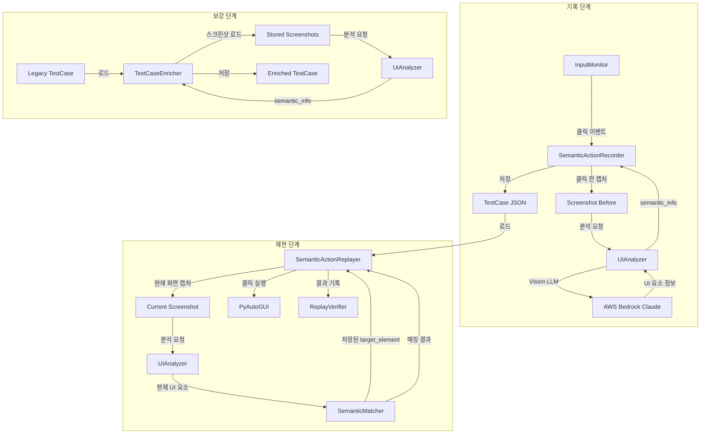

# 설계 문서: 의미론적 테스트 기록 및 재현

## 개요

본 설계는 게임 QA 자동화 시스템의 의미론적 테스트 기록 및 재현 기능을 구현한다. 핵심 목표는 클릭 시점에 UI 요소의 의미론적 정보를 캡처하여 저장하고, 재현 시 이 정보를 활용하여 UI 좌표가 변경되어도 올바른 요소를 찾아 클릭할 수 있도록 하는 것이다.

### 현재 문제점

1. `SemanticActionRecorder`가 클릭 **후**에 스크린샷을 캡처하여 클릭 대상 UI 요소 분석이 불가능
2. 테스트 케이스 JSON에 `semantic_info` 필드가 저장되지 않음
3. `SemanticActionReplayer`의 의미론적 매칭 로직이 활용되지 못함

### 해결 방안

1. 클릭 **직전** 스크린샷 캡처 및 Vision LLM 분석
2. 테스트 케이스 저장 시 의미론적 정보 포함
3. 재현 시 의미론적 매칭 우선 적용

## 아키텍처



## 컴포넌트 및 인터페이스

### 1. SemanticActionRecorder (개선)

기존 `SemanticActionRecorder`를 개선하여 클릭 직전 스크린샷 캡처 및 분석 기능을 추가한다.

```python
@dataclass
class SemanticAction(Action):
    """의미론적 액션 데이터 클래스"""
    
    # 클릭 전 스크린샷 경로 (핵심 추가)
    screenshot_before_path: Optional[str] = None
    
    # 의미론적 정보
    semantic_info: Dict[str, Any] = field(default_factory=dict)
    # {
    #     "intent": "click_button",
    #     "target_element": {
    #         "type": "button",
    #         "text": "시작",
    #         "description": "게임 시작 버튼",
    #         "bounding_box": {"x": 100, "y": 200, "width": 80, "height": 40},
    #         "confidence": 0.95
    #     },
    #     "context": {
    #         "screen_state": "main_menu",
    #         "nearby_elements": [...]
    #     }
    # }
    
    # 화면 전환 정보
    screen_transition: Dict[str, Any] = field(default_factory=dict)
    
    # 기존 필드 유지
    screenshot_path: Optional[str] = None  # 클릭 후 스크린샷 (기존 검증용)
    ui_state_hash_before: Optional[str] = None
    ui_state_hash_after: Optional[str] = None


class SemanticActionRecorder(ActionRecorder):
    """개선된 의미론적 액션 기록기"""
    
    def record_click_with_semantic_analysis(
        self, 
        x: int, 
        y: int, 
        button: str = 'left'
    ) -> SemanticAction:
        """클릭 전 의미론적 분석을 수행하여 액션 기록
        
        1. 클릭 전 스크린샷 캡처
        2. Vision LLM으로 클릭 좌표의 UI 요소 분석
        3. semantic_info 구성
        4. 클릭 후 스크린샷 캡처 (기존 검증용)
        """
        pass
    
    def _analyze_target_element(
        self, 
        image: Image.Image, 
        x: int, 
        y: int
    ) -> Dict[str, Any]:
        """클릭 좌표의 UI 요소 분석 및 target_element 구성"""
        pass
```

### 2. SemanticActionReplayer (개선)

의미론적 매칭을 우선 적용하도록 개선한다.

```python
@dataclass
class ReplayResult:
    """액션 재실행 결과"""
    action_id: str
    success: bool
    method: str  # 'semantic', 'coordinate', 'failed'
    original_coords: Tuple[int, int]
    actual_coords: Optional[Tuple[int, int]] = None
    coordinate_change: Optional[Tuple[int, int]] = None
    match_confidence: float = 0.0  # 매칭 신뢰도 추가
    screen_transition_verified: bool = False
    error_message: str = ""


class SemanticActionReplayer:
    """개선된 의미론적 액션 재생기"""
    
    def replay_click_with_semantic_matching(
        self, 
        action: SemanticAction
    ) -> ReplayResult:
        """의미론적 매칭을 우선 적용하여 클릭 재생
        
        1. 현재 화면 캡처 및 UI 분석
        2. 저장된 target_element와 매칭
        3. 신뢰도 0.7 이상이면 매칭된 좌표 사용
        4. 그렇지 않으면 원래 좌표로 폴백
        """
        pass
    
    def _find_matching_element(
        self, 
        current_ui_data: Dict, 
        target_element: Dict
    ) -> Tuple[Optional[Tuple[int, int]], float]:
        """현재 화면에서 target_element와 매칭되는 요소 찾기
        
        Returns:
            (매칭된 좌표, 신뢰도) 또는 (None, 0.0)
        """
        pass
    
    def _calculate_text_similarity(
        self, 
        text1: str, 
        text2: str
    ) -> float:
        """텍스트 유사도 계산 (0.0 ~ 1.0)"""
        pass
```

### 3. TestCaseEnricher (신규)

기존 테스트 케이스에 의미론적 정보를 추가하는 컴포넌트.

```python
@dataclass
class EnrichmentResult:
    """보강 결과"""
    total_actions: int
    enriched_count: int
    skipped_count: int  # 스크린샷 누락 등
    failed_count: int
    version: str


class TestCaseEnricher:
    """테스트 케이스 보강기"""
    
    def __init__(self, config: ConfigManager, ui_analyzer: UIAnalyzer):
        self.config = config
        self.ui_analyzer = ui_analyzer
    
    def is_legacy_test_case(self, test_case: Dict) -> bool:
        """레거시 테스트 케이스 여부 확인 (semantic_info 누락)"""
        pass
    
    def enrich_test_case(
        self, 
        test_case: Dict, 
        screenshot_dir: str
    ) -> Tuple[Dict, EnrichmentResult]:
        """테스트 케이스에 의미론적 정보 추가
        
        1. 각 클릭 액션의 스크린샷 로드
        2. Vision LLM으로 분석
        3. semantic_info 추가
        4. 기존 데이터 유지
        """
        pass
    
    def _enrich_action(
        self, 
        action: Dict, 
        screenshot_dir: str
    ) -> Tuple[Dict, bool]:
        """단일 액션 보강
        
        Returns:
            (보강된 액션, 성공 여부)
        """
        pass
```

### 4. UIAnalyzer (개선)

경계 상자(bounding box) 정보를 포함하도록 프롬프트 및 파싱 로직 개선.

```python
class UIAnalyzer:
    """개선된 UI 분석기"""
    
    def _build_vision_prompt(self) -> str:
        """경계 상자 정보를 포함하는 프롬프트"""
        return """당신은 게임 UI 분석 전문가입니다. 
        제공된 게임 화면 스크린샷을 분석하여 상호작용 가능한 UI 요소들을 식별해주세요.

        다음 형식의 JSON으로 응답해주세요:
        {
            "buttons": [
                {
                    "text": "버튼 텍스트", 
                    "x": 중심X좌표, 
                    "y": 중심Y좌표, 
                    "width": 너비, 
                    "height": 높이, 
                    "bounding_box": {"x": 좌상단X, "y": 좌상단Y, "width": 너비, "height": 높이},
                    "confidence": 신뢰도
                }
            ],
            ...
        }
        """
    
    def find_element_at_position(
        self, 
        ui_data: Dict, 
        x: int, 
        y: int, 
        tolerance: int = 50
    ) -> Optional[Dict]:
        """특정 좌표에서 가장 가까운 UI 요소 찾기"""
        pass
```

## 데이터 모델

### 테스트 케이스 JSON 구조 (개선)

```json
{
  "name": "test_case_name",
  "version": "2.0",
  "created_at": "2025-12-24T00:00:00",
  "enriched_at": "2025-12-24T01:00:00",
  "actions": [
    {
      "timestamp": "2025-12-24T00:00:01",
      "action_type": "click",
      "x": 966,
      "y": 279,
      "description": "클릭 (966, 279)",
      "button": "left",
      "screenshot_path": "screenshots/action_0000.png",
      "screenshot_before_path": "screenshots/action_0000_before.png",
      "semantic_info": {
        "intent": "click_button",
        "target_element": {
          "type": "button",
          "text": "시작",
          "description": "게임 시작 버튼",
          "bounding_box": {
            "x": 926,
            "y": 259,
            "width": 80,
            "height": 40
          },
          "confidence": 0.95
        },
        "context": {
          "screen_state": "main_menu"
        }
      },
      "screen_transition": {
        "transition_type": "full_transition",
        "hash_difference": 45
      }
    },
    {
      "timestamp": "2025-12-24T00:00:03",
      "action_type": "wait",
      "x": 0,
      "y": 0,
      "description": "5.0초 대기"
    }
  ]
}
```

## 정확성 속성 (Correctness Properties)

*속성(property)은 시스템의 모든 유효한 실행에서 참이어야 하는 특성 또는 동작입니다. 속성은 사람이 읽을 수 있는 명세와 기계가 검증할 수 있는 정확성 보장 사이의 다리 역할을 합니다.*

### Property 1: 클릭 액션의 의미론적 정보 완전성

*임의의* 클릭 액션에 대해, 기록이 완료되면 해당 액션은 반드시 물리적 좌표(x, y)와 semantic_info(target_element 포함)를 모두 포함해야 한다.

**Validates: Requirements 1.3, 1.4**

### Property 2: 직렬화 왕복 동등성 (Round-trip Equivalence)

*임의의* SemanticAction에 대해, JSON으로 직렬화한 후 역직렬화하면 원본과 동등한 SemanticAction이 복원되어야 한다. 이는 모든 중첩 구조(semantic_info, target_element, bounding_box 등)를 포함한다.

**Validates: Requirements 2.4, 2.5, 6.1, 6.2, 6.3, 6.4**

### Property 3: 신뢰도 기반 매칭 결정

*임의의* 재생 액션에 대해, 매칭 신뢰도가 0.7 이상이면 매칭된 좌표를 사용하고, 0.7 미만이면 원래 좌표를 사용해야 한다.

**Validates: Requirements 3.3, 3.4**

### Property 4: 텍스트 유사도 대칭성

*임의의* 두 텍스트 문자열 A, B에 대해, similarity(A, B) == similarity(B, A)이어야 한다.

**Validates: Requirements 3.2**

### Property 5: 보강 시 기존 데이터 보존

*임의의* 레거시 테스트 케이스에 대해, 보강 후에도 기존의 screenshot_path, timestamp, x, y, description 등의 필드는 변경되지 않아야 한다.

**Validates: Requirements 5.6**

### Property 6: 레거시 테스트 케이스 감지 정확성

*임의의* 테스트 케이스에 대해, semantic_info 필드가 없거나 비어있는 클릭 액션이 하나라도 있으면 레거시로 감지되어야 한다.

**Validates: Requirements 5.1**

### Property 7: 재생 통계 일관성

*임의의* 재생 세션에 대해, semantic_match_count + coordinate_match_count + failed_count == total_actions이어야 한다.

**Validates: Requirements 4.1, 4.4**

### Property 8: None 필드 직렬화 일관성

*임의의* SemanticAction에서 선택적 필드가 None인 경우, 직렬화 후 역직렬화해도 해당 필드는 None으로 복원되어야 한다.

**Validates: Requirements 6.5**

## 오류 처리

### Vision LLM 실패 시

1. 지수 백오프로 최대 3회 재시도
2. 재시도 실패 시 OCR 폴백
3. OCR도 실패 시 빈 semantic_info로 기록 (좌표 기반 재현만 가능)

### 스크린샷 누락 시 (보강)

1. 해당 액션을 `enrichment_status: "skipped"` 로 표시
2. 나머지 액션 계속 처리
3. 최종 결과에 스킵된 액션 수 보고

### 매칭 실패 시 (재현)

1. 원래 좌표로 폴백
2. `method: "coordinate"` 로 기록
3. 경고 로그 출력

## 테스트 전략

### 단위 테스트

- `SemanticActionRecorder.record_click_with_semantic_analysis()` 동작 검증
- `SemanticActionReplayer._find_matching_element()` 매칭 로직 검증
- `TestCaseEnricher.enrich_test_case()` 보강 로직 검증
- `UIAnalyzer.find_element_at_position()` 요소 탐색 검증

### Property-Based 테스트

Property-based 테스트에는 **Hypothesis** 라이브러리를 사용한다. 각 property 테스트는 최소 100회 반복 실행한다.

- Property 2: 직렬화 왕복 테스트 - 임의의 SemanticAction 생성 후 round-trip 검증
- Property 3: 신뢰도 임계값 테스트 - 임의의 신뢰도 값에 대한 매칭 결정 검증
- Property 4: 텍스트 유사도 대칭성 테스트 - 임의의 문자열 쌍에 대한 대칭성 검증
- Property 5: 보강 데이터 보존 테스트 - 임의의 테스트 케이스 보강 후 기존 데이터 유지 검증
- Property 6: 레거시 감지 테스트 - 다양한 테스트 케이스 구조에 대한 감지 정확성 검증
- Property 7: 통계 일관성 테스트 - 임의의 재생 결과에 대한 카운트 합계 검증
- Property 8: None 필드 처리 테스트 - 선택적 필드가 None인 경우의 직렬화 검증

### 통합 테스트

- 전체 기록 → 저장 → 로드 → 재현 흐름 검증
- 레거시 테스트 케이스 보강 → 재현 흐름 검증
- UI 좌표 변경 시나리오에서의 의미론적 매칭 검증
